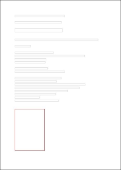

# hl-doc-extractor-pdf 

**A simple lightweight (&ast; 2.50 MB) Java PDF extractor based on [PDFBox](https://github.com/apache/pdfbox) that supports custom content-sorting orders.** 
* 250 KB including PDFBox jar files. 
 

**Sample Code:** 
 
&nbsp;&nbsp;//## Initialize PDF Extract with a file 
&nbsp;&nbsp;PDFExtractor extractor = new PDFExtractor\(new File\("file.pdf"\)\); 
&nbsp;&nbsp;&nbsp;&nbsp;extractor\.setSortingOrder(SORT.BY_PAGE, SORT.BY_Y, SORT.BY_X);  //## Optional item sorting order 
 
&nbsp;&nbsp;//## Extract PDF content by page 
&nbsp;&nbsp;ExtractedContent data = null; 
&nbsp;&nbsp;&nbsp;&nbsp;data = extractor\.extractAll(); //## all pages 
&nbsp;&nbsp;&nbsp;&nbsp;data = extractor\.extractPage(2); //## specified page - 2 
&nbsp;&nbsp;&nbsp;&nbsp;data = extractor\.extractPages(1,3); //## page range - 1 to 3 
 
&nbsp;&nbsp;//## Export to JSON [sample](samples/json/sample_extracted-json.json) 
&nbsp;&nbsp;JSONObject jsonData = data\.toJsonFormat(true);   //## true to include image base64 
 
&nbsp;&nbsp;//## Export to Plain Text [sample](samples/plaintext/sample_extracted-plaintext.txt) & Images [sample](samples/plaintext/image_1_p1_74-540_146x205.jpg) 
&nbsp;&nbsp;JSONObject jsonData = data\.toPlainTextFormat\(true\);   //## true to include page number 
&nbsp;&nbsp;&nbsp;&nbsp;Map<String,BufferedImage> mapImages = data.getExtractedBufferedImages\(\);   //## <FileName, BufferedImage> 
 
&nbsp;&nbsp;//## Render page layout [sample](samples/layout/sample_page_layout.jpg) as BufferedImage 
&nbsp;&nbsp;MetaData meta = data\.getMetaData\(\); 
&nbsp;&nbsp;&nbsp;&nbsp;List<ContentItem> page1Data = aExtractData\.getContentItemListByPageNo\(1\); 
&nbsp;&nbsp;&nbsp;&nbsp;BufferedImage imgLayout = ContentUtil\.renderPageLayout\( 
&nbsp;&nbsp;&nbsp;&nbsp;&nbsp;&nbsp;&nbsp;&nbsp;meta\.getPageWidth\(\), &nbsp;meta\.getPageHeight\(\),  
&nbsp;&nbsp;&nbsp;&nbsp;&nbsp;&nbsp;&nbsp;&nbsp;Color\.WHITE, //# background color 
&nbsp;&nbsp;&nbsp;&nbsp;&nbsp;&nbsp;&nbsp;&nbsp;false, //# render text 
&nbsp;&nbsp;&nbsp;&nbsp;&nbsp;&nbsp;&nbsp;&nbsp;page1Data\); //# page's extracted item 
 
 
**Sample Rendered Page Layout:** 

